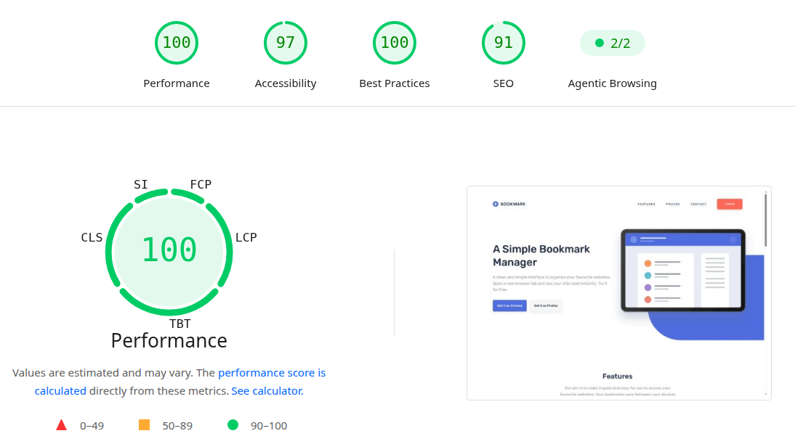

# Bookmark Landing Page

A fully responsive landing page built with **React**, optimized for achieving high **Core Web Vitals** results.

**🌐 Live Demo: [Click!](https://bookmark-landing-page-psi-eight.vercel.app/)**

---

## 🏗️ Technologies & Tools

### Environment

- Vite
- React
  - Functional Components
  - `useState`
  - `useEffect`

### Styling

- CSS Modules
- BEM Methodology
- Mobile-first

### Deployment

- Vercel

---

## 📁 Project Structure

```text
bookmark-landing-page/
├── public/
├── src/
│   ├── assets/
│   │   ├── fonts/
│   │   └── images/
│   ├── components/
│   │   ├── Container/
│   │   ├── Extension/
│   │   ├── Faq/
│   │   ├── Features/
│   │   ├── Footer/
│   │   ├── Header/
│   │   ├── Hero/
│   │   ├── icons/
│   │   ├── Modal/
│   │   └── Newsletter/
│   ├── App.jsx
│   ├── global.css
│   └── main.jsx
├── .gitignore
├── eslint.config.js
├── index.html
├── package.json
├── README.md
└── vite.config.js
```

---

## 💻 Getting Started

### Installation

```bash
git clone https://github.com/bartolinidev/bookmark-landing-page.git
cd bookmark-landing-page
npm install
npm run dev
```

---

## ✨ Key Features

- Fully Responsive Layout

- Mobile Navigation

- Interactive Features Tabs

- FAQ Accordion

- Animated Counter

- Newsletter Validation

- Modal on Exit-Intent & Timeout

---

## ✅ Performance

The project was created with a focus on accessibility, performance, and responsiveness.

Check it yourself by pasting the project link on the [PageSpeed Insights website](https://pagespeed.web.dev/) and click "Analyze" button.



---

## ↗️ Areas to improve

### Navigation Improvements

Standardize section identifiers and navigation links for better UX and DX.

### Native Dark Mode

Implement automatic system theme detection using native CSS features:

```css
:root {
  color-scheme: light dark;
}

.element {
  color: light-dark(black, white);
  background-color: light-dark(white, black);
}
```

### Backend Integration

Connect the newsletter form to a backend API such as:

- Node / Express.js
- express-validator
